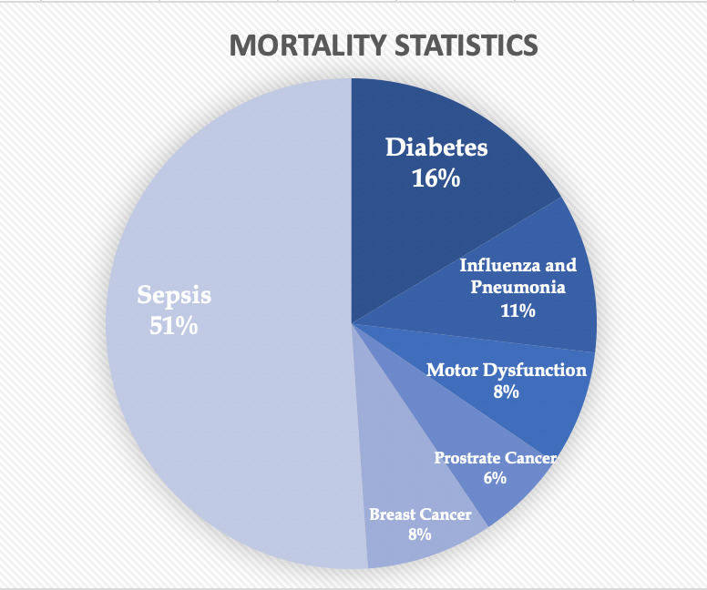

<h1><u>Sepsis Detection System</u></h1>

Sepsis is a fatal condition caused by infection and
subsequent overreaction by the immune system.

A survey conducted on the cause of death of 500,000 patients resulted in a distribution as follows:

The model used in the project can detect Sepsis in patients upto 6 hours before detection by medical authorities.

<h1><u>Using the backend</u></h1>
Follow the steps mentioned below to run the backend and use the rest api.

<h2><u>Using Conda</u></h2>

- Install the environment using
  `conda env create -f Backend/environment.yml`

- Download model from [here](https://drive.google.com/file/d/1-21YgMwcJN7CwOaQVQX2JQwy1V_044Z3/view?usp=sharing) and store it in Backend/SepsisBackend/APIEndPoint/TrainedModel/ directory.

- Activate the conda environment using
  `conda activate pasckathon`

- Run the backend server using `python Backend/SepsisBackend/manage.py runserver`

<h2><u>Without Conda</u></h2>
  
Note that pip package installer is required to install the packages.

- The important packages to run the backend are stored in the requirements.txt file. Install them using `pip install -r Backend/requirements.txt`
- Download model from [here](https://drive.google.com/file/d/1-21YgMwcJN7CwOaQVQX2JQwy1V_044Z3/view?usp=sharing) and store it in Backend/SepsisBackend/APIEndPoint/TrainedModel/ directory.

- Run the backend server using `python Backend/SepsisBackend/manage.py runserver` or `python3 SepsisBackend/manage.py runserver`

<h1><u>Using the frontend</u></h1>
  Note that npm package installer is needed to be installed for running the react.js modules.

- Run `npm i` in the Frontend directory to install the required packages.
- In the same directory run the `npm start` to start the react server.
- Open http://localhost:3000 to view it in the browser.
